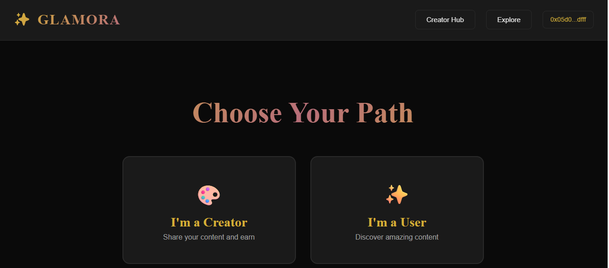
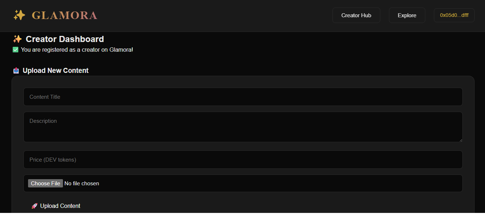
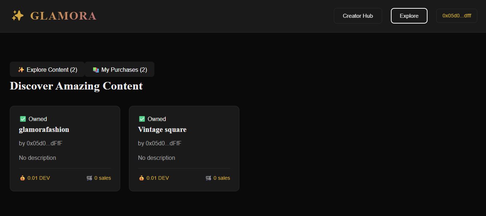
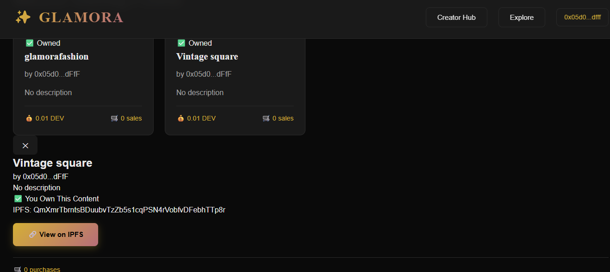
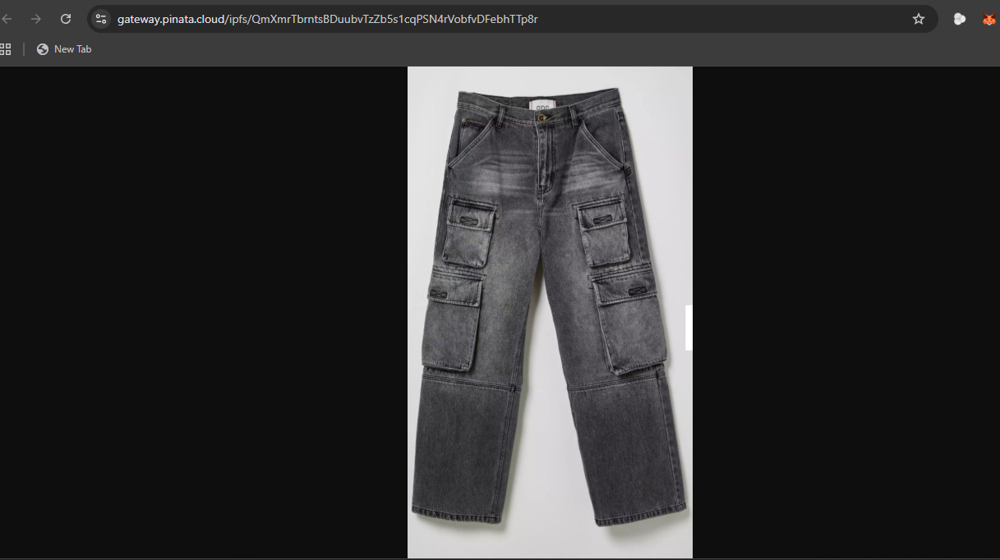

# GLAMORA
**Where Fashion Meets Web3**

A decentralized content marketplace empowering fashion creators through blockchain technology.

**Built on Moonbeam | Powered by IPFS | Secured by Smart Contracts**

---

## The Story Behind Glamora

As a fashion enthusiast and designer, I've watched talented creators lose 30-50% of their earnings to centralized platforms. Instagram, TikTok, Patreon - they all take massive cuts while controlling what you post, who sees it, and whether it stays up.

I asked myself: What if creators could own their content, set their own prices, and keep 100% of their earnings?

That's how Glamora was born.

---

## The Problem

Fashion creators face multiple barriers:

**High Platform Fees**
- YouTube takes 45%
- Patreon takes 12%
- OnlyFans takes 20%

**No True Ownership**
- Content lives on centralized servers
- Platforms control everything
- Can delete your work anytime

**Algorithm Dependency**
- Platforms decide who sees your work
- Especially harsh for creators in developing countries

**Arbitrary Censorship**
- Content removed without warning
- No appeals process

**Delayed Payments**
- Wait weeks for earnings
- High withdrawal minimums

---

## The Solution

Glamora provides:

- ✅ **Near-Zero Fees** - Only gas costs (pennies on Moonbeam)
- ✅ **True Ownership** - Content on IPFS, records on blockchain
- ✅ **Direct Discovery** - No algorithm middleman
- ✅ **Censorship Resistant** - Immutable blockchain records
- ✅ **Instant Payments** - Withdraw earnings anytime

---

## How It Works

### For Creators
1. Connect your MetaMask wallet
2. Register as a creator (one-time, on-chain)
3. Upload your content (image/video)
4. Content goes to IPFS, hash stored on blockchain
5. Set your price in DEV tokens
6. Earn 100% of sales, withdraw instantly

### For Users
1. Browse content (no wallet needed!)
2. Connect wallet to purchase
3. One-click purchase with MetaMask
4. View purchased content on IPFS forever
5. Full transaction history on blockchain

---

## Technical Architecture

### Smart Contracts (Solidity)

**GlamoraHub.sol - The Brain**
- Manages creator registry
- Validates creator status
- Coordinates between contracts

**CreatorProfile.sol - The Identity**
- Stores creator information
- Manages profile metadata
- Links wallet addresses to identities

**ContentPayment.sol - The Money**
- Handles content uploads
- Processes purchases
- Manages revenue distribution

### Frontend Stack
- React 18 with TypeScript
- Vite for fast builds
- ethers.js v5 for blockchain interaction
- Custom CSS with luxury design system
- MetaMask integration

### Storage Layer

**Why IPFS?**
- Content can't be deleted (immutable)
- Distributed globally (censorship-resistant)
- No single point of failure
- Fast retrieval via Pinata gateway

---

## Getting Started

### Prerequisites
- Node.js v20 or higher
- MetaMask browser extension
- DEV tokens from Moonbase Alpha faucet

### Installation

**1. Clone the repository**
```bash
git clone https://github.com/Terese678/glamora-polkadot.git
cd glamora-polkadot
```

**2. Install dependencies**
```bash
# Install contract dependencies
npm install

# Install frontend dependencies
cd glamora-frontend
npm install
cd ..
```

**3. Configure environment**

Create a `.env` file in the root directory with:
```
PRIVATE_KEY=your_moonbase_private_key
```

**4. Deploy contracts (optional - already deployed)**
```bash
npx hardhat run scripts/deploy.js --network moonbase
```

**5. Update contract addresses**

If you deployed new contracts, update these files:
- `glamora-frontend/src/deployed-addresses.json`
- `glamora-frontend/src/Web3Context.tsx`

**6. Launch the app**
```bash
cd glamora-frontend
npm run dev
```

**7. Open in browser**
```
http://localhost:5173
```

**8. Get test tokens**

Visit [Moonbeam Faucet](https://faucet.moonbeam.network) and request DEV tokens for testing.

---

## Dependencies

### Smart Contracts
```json
{
  "@openzeppelin/contracts": "^5.1.0",
  "hardhat": "^2.22.16",
  "@nomicfoundation/hardhat-toolbox": "^5.0.0",
  "ethers": "^5.7.2"
}
```

### Frontend
```json
{
  "react": "^18.3.1",
  "react-dom": "^18.3.1",
  "ethers": "^5.7.2",
  "vite": "^5.4.10",
  "typescript": "~5.6.2",
  "axios": "^1.7.7"
}
```

Full dependency lists available in `package.json` files.

---

## Live Deployment

### Moonbase Alpha Testnet

**Verified Contracts:**
- **GlamoraHub:** `0x4fe1D1b42E734c52365C0DdF2C94bf34f6e07115`
- **CreatorProfile:** `0x17D58639c871D848e31597372056CBb548F3fE93`
- **ContentPayment:** `0x86eC3e58B69e9975d572d099814c2F470E18b2e6`

[View on Moonscan Explorer](https://moonbase.moonscan.io)

**Network Details:**
- **Chain ID:** 1287
- **RPC:** https://rpc.api.moonbase.moonbeam.network
- **Currency:** DEV (testnet token)

---

## Features

### ✅ Working Features

**For Creators:**
- MetaMask wallet registration
- IPFS content upload (images/videos tested)
- Custom pricing in DEV tokens
- Real-time sales tracking
- Instant earnings withdrawal

**For Users:**
- Browse all content
- Wallet-based purchases
- One-click MetaMask transactions
- IPFS content viewing
- On-chain purchase history

**Design:**
- Luxury fashion aesthetic (gold + black)
- Responsive layout
- Smooth animations
- Full-screen experience

---

## Design Philosophy

Fashion meets functionality.

- **Dark Luxury** - #0a0a0a background
- **Gold Accents** - #d4af37 for prestige
- **Rose Gold** - #b76e79 for elegance
- **Playfair Display** - Sophisticated serif for headings
- **Inter** - Clean sans-serif for body text

Every pixel intentional. Every interaction smooth.

---

## Testing Guide

### Test as Creator
1. Navigate to app in browser
2. Click "Connect Wallet"
3. Approve MetaMask connection
4. Click "Creator Hub"
5. Register with username and bio
6. Confirm transaction in MetaMask
7. Upload content:
   - Add title and description
   - Set price (e.g., 0.01 DEV)
   - Select image/video file
   - Click "Upload Content"
   - Confirm IPFS upload and blockchain transaction
8. See your content in dashboard!

### Test as User
1. Click "Explore" in navigation
2. Browse available content
3. Click any content card
4. Modal shows details and price
5. Click "Purchase Now"
6. Confirm MetaMask transaction
7. Click "View on IPFS" to see content
8. Check "My Purchases" tab

**Real Test Data:**
- "glamorafashion" - Fashion tutorial (0.01 DEV)
- "Vintage square" - Fashion photo (0.01 DEV)
- Both fully viewable on IPFS!

---

## Screenshots

### Landing Page

*Welcome screen with wallet connection*

### Creator Dashboard  

*Upload and manage fashion content*

### Explore Page

*Browse available content*

### Content Modal

*Purchase and view content details*

### IPFS Verification

*Content stored and verified on IPFS via Pinata*

---

## Build Journey

### Weeks 1-2: Smart Contracts
- Designed three-contract architecture
- Implemented creator registration system
- Built content management logic
- Added secure payment handling

### Weeks 3-4: The Struggles
- ❌ Contracts wouldn't deploy → ✅ Fixed Solidity version
- ❌ Contract interactions failing → ✅ Corrected ABI imports
- ❌ IPFS uploads timing out → ✅ Switched to Pinata

### Weeks 5-6: Frontend & Polish
- Built luxury UI with custom CSS
- Integrated MetaMask wallet
- Created creator and user dashboards
- Implemented IPFS content viewing
- ❌ Function name mismatches → ✅ Used correct ABI methods

### The Result
A working decentralized marketplace where creators upload in seconds, content lives forever on IPFS, and purchases happen on-chain with full transparency.

---

## Lessons Learned

### What Went Wrong

**"content is not a function" error**
- Problem: Called wrong contract method
- Solution: Used `getContent()` from actual ABI
- Learning: Always verify ABI exports

**Broken IPFS URLs**
- Problem: Test data had fake hashes
- Solution: Filtered out test content
- Learning: Clean test data before demos

**Half-screen layout**  
- Problem: DevTools affected CSS
- Solution: Added proper viewport settings
- Learning: Test with DevTools closed

### What I'd Do Differently
- Start with proper TypeScript types from day one
- Write contract tests before deployment
- Use Remix IDE for faster contract debugging
- Deploy to testnet earlier in development

---

## Why Moonbeam?

I chose Moonbeam because:

- **EVM Compatible** - My Solidity skills transferred perfectly
- **Fast & Cheap** - Uploads cost pennies, confirm in seconds
- **Great Documentation** - Clear examples, active community
- **Real Substrate** - Connected to Polkadot ecosystem
- **Production Ready** - Not just a testnet toy

Moonbase Alpha handled everything I threw at it. Zero downtime. Fast confirmations. Perfect for content platforms.

---

## Platform Sustainability

**Current Implementation:** Creators receive 100% to demonstrate zero-fee capability.

**Production Options:**
- Optional 2-5% platform fee (still 90%+ better than Web2)
- Covers IPFS pinning, gas optimization, development
- Community governance for fee decisions
- Premium features for advanced creators

This proves the technology works. Business model is flexible and community-driven.

---

## What's Next

### Immediate (Post-Hackathon)
- [ ] Creator earnings dashboard with charts
- [ ] Content categories and search
- [ ] User profiles and favorites
- [ ] Email notifications for sales

### Near Future  
- [ ] Subscription models (monthly access)
- [ ] Bulk content uploads
- [ ] Advanced analytics for creators
- [ ] Mobile app (React Native)

### Dream Features
- [ ] NFT minting for exclusive content
- [ ] Creator collaborations
- [ ] DAO governance for platform decisions
- [ ] Deploy to Moonbeam mainnet
- [ ] Cross-chain integration with parachains

---

## Project Structure

```
glamora-polkadot/
├── contracts/              # Solidity smart contracts
│   ├── GlamoraHub.sol
│   ├── CreatorProfile.sol
│   └── ContentPayment.sol
├── scripts/                # Deployment scripts
│   └── deploy.js
├── test/                   # Contract tests
├── glamora-frontend/       # React frontend
│   ├── src/
│   │   ├── components/     # React components
│   │   ├── contracts/      # Contract ABIs
│   │   ├── Web3Context.tsx # Web3 provider
│   │   └── ipfsHelper.ts   # IPFS utilities
│   └── public/
├── hardhat.config.ts       # Hardhat configuration
├── deployed-addresses.json # Contract addresses
└── README.md              # This file
```

---

## Demo Video

*Coming soon - full walkthrough of platform features*

---

## License

MIT License - Use it, fork it, improve it!

---

## Acknowledgments

Built solo but learned from:
- Moonbeam documentation
- Hardhat tutorials
- OpenZeppelin contracts
- IPFS/Pinata guides
- Stack Overflow community

---

## Connect

- **GitHub**: https://github.com/Terese678
- **Twitter**: @ter_chimbiv
- **Email**: dredgeclassics@gmail.com

Built by Timothy Terese Chimbiv

*"In Web3, creators own the means of production."*

---

## Polkadot Hackathon 2025

**Theme:** User-Centric Apps

This project demonstrates how Polkadot's technology stack (through Moonbeam) creates real-world impact for content creators, staying true to Web3 principles of ownership, transparency, and user empowerment.

**Radically Useful:**
- Solves real creator pain points
- Works today (not just a concept)
- Built on production-ready technology
- Generates actual value for users

**Radically Open:**
- 100% open source
- Fully transparent on-chain
- No gatekeepers
- Permissionless participation
